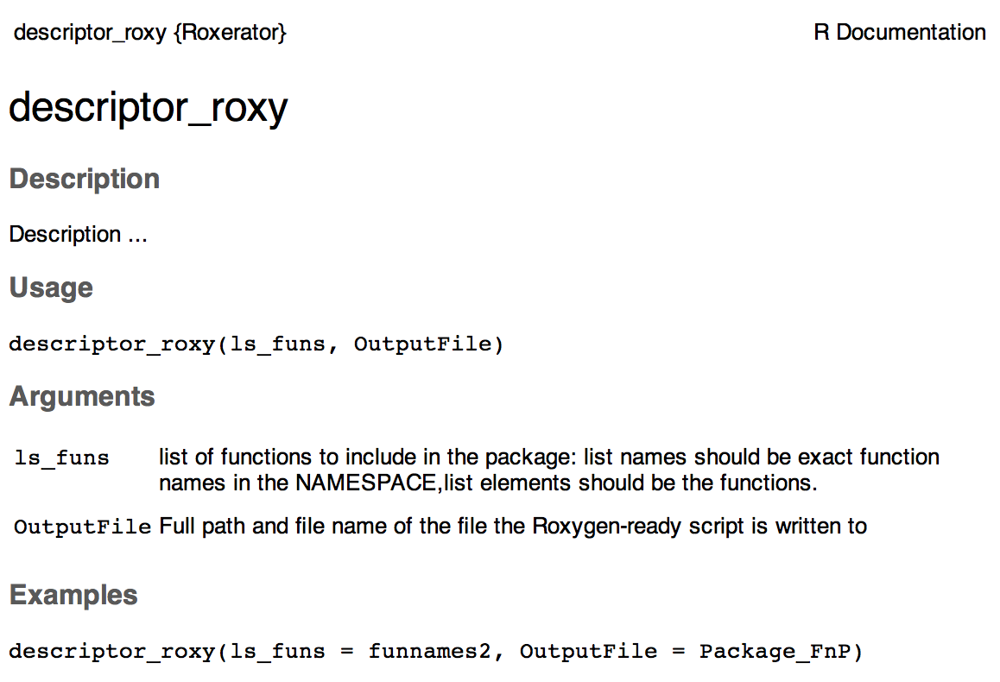

# RoxygenReady
Prepare your R function library to be compiled into an R package by Roxygen

      site under construction


## A Workflow and an R package to stream line package creation

[Roxygen2](https://cran.r-project.org/web/packages/roxygen2/index.html) is an awesome tool to easily create a package from your function library


### Workflow: how to create an R package (overview)
> check: Workflow_to_Create_an_R_Package.R for details

1. Write or collect your favourite functions into an R script 
- **Extract** all **function names** from the script 
- **Prepare** in-line documentation **with RoxygenReady** / Create Roxy-ready prepared script as a copy 
- Manual editing of in-line description
- **Compile** a package & documentation **by roxygen2**
- **Install** your package
- Test your package
- Upload to github
- Test if you can install from github 

### Installation

Install directly from github via devtools:

```
# install.packages("devtools")
devtools::install_github(username ="vertesy" ,repo = "RoxygenReady", subdir = "RoxygenReady")
require("RoxygenReady")
```

### Package content

3 functions to generate inline description from your functions, using their names and arguments as input. These can be later parsed by Roxygen to proper package's help section
An example inline description:


       #' descriptor_roxy
       #'
       #' Description ...
       #' @param ls_funs list of functions to include in the package: list names should be exact function names in the NAMESPACE,list elements should be the functions.
       #' @param OutputFile Full path and file name of the file the Roxygen-ready script is written to
       #' @examples descriptor_roxy(ls_funs = funnames2, OutputFile = Package_FnP)
       #' @export

#### This will be parsed automatically to:


